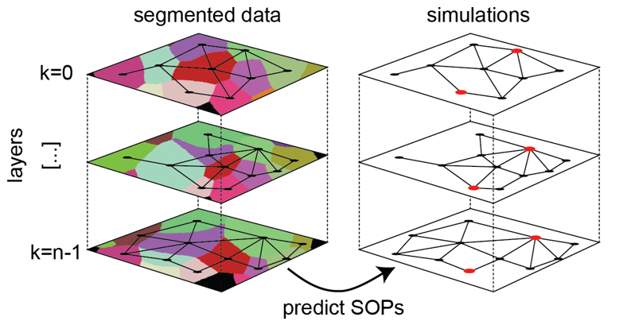

A Multi-layer Model for Notch-Delta Signalling
======================================================================

The Multi-layer Signalling Model (MSM) is a computational toolkit for simulating and analysing Notch-Delta signalling in three-dimensional epithelial tissues. It accounts for depth-resolved cell-cell contacts across apical and lateral surfaces, enabling systematic exploration of how tissue geometry and signalling range influence lateral inhibition and pattern formation.

.. toctree::
   :maxdepth: 1
   :caption: Contents

   overview
   quickstart
   data_layout
   function_reference
   release_notes

   Multi-layer Signalling Model (MSM) overview. Segmented 3D cellular data across successive tissue layers (left) are used to construct a depth-resolved contact network. The MSM simulates lateral inhibition on this layered structure to predict SOP fate decisions (right), incorporating both apical and lateral cell-cell interactions. Adapted from Paci et al. (2025).

Citation
===========

If you use this model or documentation in your work, please cite:

- Paci, G., Berkemeier, F., Baum, B., Page, K.M., & Mao, Y. 3D epithelial cell topology tunes signalling range to promote precise patterning. *bioRxiv* (2025). `doi.org/10.1101/2025.08.08.668674 <https://www.biorxiv.org/content/10.1101/2025.08.08.668674v1>`_

Bugs, Questions and Comments
============================

If you encounter any issues or have questions about how to use the software, please open a `GitHub issue <https://github.com/fberkemeier/MultiLayer-NotchDelta/issues>`_. Feedback is a valuable part of the ongoing development. For comments or suggestions regarding improvements to the software or the documentation, you may also contact Francisco Berkemeier by email at fp409@cam.ac.uk.
