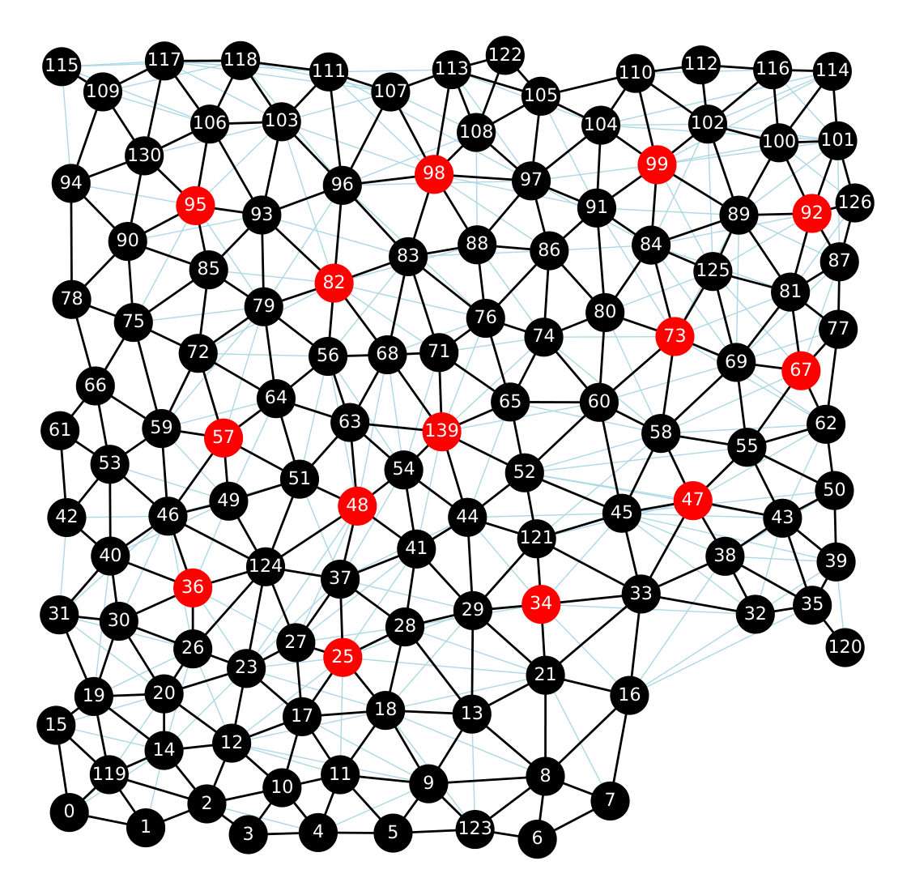
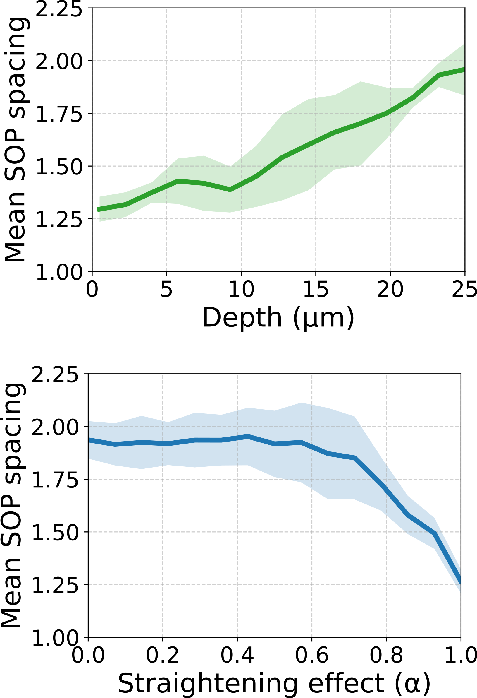

Quickstart
==========

This guide walks through what each section of ``notebooks/msm_notebook.ipynb`` does,
what options you can tune, and what outputs to expect.
For input-file formatting rules, see :doc:`data_layout`.
For argument-by-argument details of the main Python functions, see :doc:`function_reference`.

Before you start
----------------

Clone the repository:

.. code-block:: powershell

   git clone https://github.com/fberkemeier/MultiLayer-NotchDelta.git

From the repository root:

.. code-block:: powershell

   pip install -r requirements.txt
   jupyter notebook notebooks/msm_notebook.ipynb

Detailed walkthrough
--------------------

1. Dependencies and MSM import
^^^^^^^^^^^^^^^^^^^^^^^^^^^^^^

This section imports standard scientific Python libraries and then imports functions from ``src/msm_model.py``.
Use this as a quick sanity check: if import fails here, fix environment/dependency issues before running analysis cells.

2. Data setup and region selection
^^^^^^^^^^^^^^^^^^^^^^^^^^^^^^^^^^

This section defines which datasets to run and builds all dictionaries used later.

Typical pattern:

.. code-block:: python

   wing_regions = ['wd_1', 'wd_2', 'wd_3']

   wing_discs = list_wing_discs(wing_regions)
   signalling_labels_dict = load_signalling_labels_dict(wing_regions)
   wd_dict = build_wd_label_dict(wing_regions)
   gap_dict = build_gap_dict(wing_regions)
   n_dict = build_n_layers_dict(wing_regions)
   heights_dict = build_default_height_dict(wing_regions)

   A_dict = build_adjacency_dict(wing_regions)
   centroids_dict = build_centroids_dict(wing_regions)
   area_apical_dict = build_area_apical_dict(wing_regions)
   diam_apical_dict = build_diam_apical_dict(wing_regions)

Key options in this section:

- ``wing_regions``: controls which region files are loaded and analyzed.
- ``notch_data``: user-owned intensity profile array (editable per dataset).
- ``heights_dict``: can use metadata defaults or values derived from ``height_set``.

If this section fails, the most common cause is mismatched names between ``wing_region_metadata.csv`` and file names in ``data/``.

3. Single simulation (graph plot)
^^^^^^^^^^^^^^^^^^^^^^^^^^^^^^^^^

This subsection sets model parameters and runs one call to ``compute_band_distance`` for a selected region.
It is the best entry point to validate that your data and parameters produce expected spatial patterns.

Main parameters users typically change:

- ``wing_region``: which dataset to run.
- ``Lmax``: signalling depth cutoff.
- ``omega_type``: depth-weight function (``exp``, ``cnt``, ``lin``, ``exp0``).
- ``k, h, Ka, Kr, nu``: Notch-Delta model parameters.
- ``alpha``: straightening level for non-apical contacts.
- ``graphsaveQ``: whether to save the graph image to ``figures/``.

   MSM simulation over a wing disc. SOP cells are displayed in red (high Delta).

4. SOP spacing plots
^^^^^^^^^^^^^^^^^^^^

This subsection sweeps depth values (``Lmax_list``) and computes spacing statistics across selected regions.
It is used to quantify how signalling range affects spacing robustness and degeneracy.

You can control:

- ``spsteps``: number of sampled depth points.
- ``threshold``: SOP threshold used for classification.
- ``normalQ``: normalize depth weights to a common support.
- ``sim_number``: number of repeated simulations per condition.
- plotting style through ``fancy_plot`` parameters.

   SOP spacing vs depth and straightening for 3 wing discs (``wd_1``, ``wd_2``, and ``wd_3``).

5. Other analyses
^^^^^^^^^^^^^^^^^

This final section contains complementary analyses:

- ``3D neighbour counts``: tests how non-apical connectivity changes under straightening (``alpha`` sweep).
- ``Notch intensity fitting``: fits an exponential profile to measured Notch data.
- ``Signalling weight histograms``: visualizes integrated layer weights ``omega_k`` by region.

These analyses are useful for mechanistic interpretation and parameter diagnostics before running larger sweeps.

Practical usage patterns
------------------------

- Run one region first (for example ``['wd_1']``) to validate data and runtime.
- Keep ``randomQ=False`` when you want deterministic debugging runs.
- Enable save flags only once plots look correct to avoid clutter in ``figures/``.
